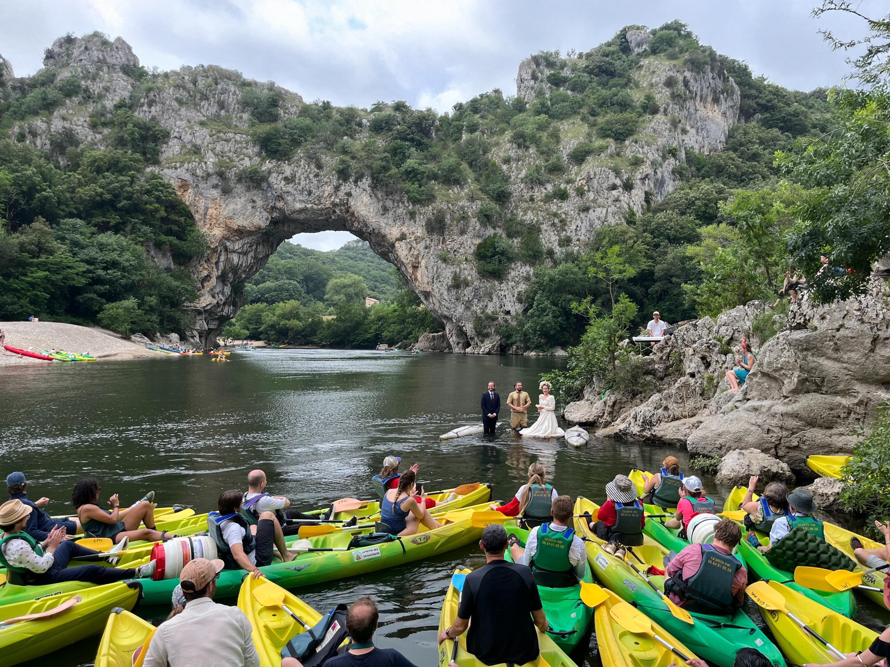

Assistant Professor (Quantum Computing), [King's Quantum](https://www.kcl.ac.uk/nmes/research/kings-quantum) at [King's College London](https://www.kcl.ac.uk)\\
Fellow (Quantum Policy), [Belfer Center for Science and International Affairs, Harvard Kennedy School](https://www.belfercenter.org/people/eleanor-crane) \\
Editor, [Quantum](https://quantum-journal.org), Open Access Peer-reviewed Non-profit Quantum Science Journal

My goal is to enable quantum simulation of nature using error-corrected quantum computers made of qubits, fermions, and bosons (see [Qiskit Seminar Series](https://www.google.com/url?sa=t&source=web&rct=j&opi=89978449&url=https://www.youtube.com/watch%3Fv%3D5dyUNsh8Q9E&ved=2ahUKEwiPy9OO2oKLAxVGvokEHcm7ArYQwqsBegQIDRAE&usg=AOvVaw3ueBJk0AdnNi4DKtmB0Hty)). Find my published and peer-reviewed articles on [Google Scholar](https://scholar.google.com/citations?user=b8v4d0sAAAAJ&hl=en&oi=sra) and the wonderful, open access (non-peer reviewed) [arXiv](https://arxiv.org/search/quant-ph?searchtype=author&query=Crane,+E).

I research and teach quantum policy for [Defense, Emerging Technology, and Strategy](https://www.belfercenter.org/programs/defense-emerging-technology-and-strategy) with Eric Rosenbach at the [Belfer Center for Science and International Affairs](https://www.belfercenter.org) at the [Harvard Kennedy School of Government](https://www.hks.harvard.edu).

Previously, I did a [postdoc at MIT](https://meche.mit.edu/people/staff/emc2@mit.edu), working with Seth Lloyd and Isaac Chuang. I was a board member of the [MIT European Club](https://euroclub.mit.edu/board). Organised the [MIT European Career Fair](https://euro-career.mit.edu). Organised the [Harvard European Conference](https://euroconf.eu). Was a teaching assistant for leadership course [LEAPS](https://physics.mit.edu/academic-programs/subjects/mitleaps/) (MIT). Completed  [Transforming Systems](https://locator.tlt.harvard.edu/course/gse-205506/2025/spring/19970) (Harvard), and [Adaptive Leadership](https://www.hks.harvard.edu/publications/practice-adaptive-leadership-tools-and-tactics-changing-your-organization-and-world) (Harvard). Grew up in a superposition of England and France, and enjoy adventures, whatever the nature. 

## News

- **[Nov. 2025]** Innovate UK funding for collaboration with QuEra, Phasecraft, Coversion, Mesolens, UCL and Oxford starts.
- **[Oct. 2025]** Entering the [semifinal of the Google XPRIZE (King's News article)](https://www.kcl.ac.uk/news/kings-quantum-scientist-enters-semifinal-of-major-global-competition), competing for 5M $ prize purse!
- **[Sep. 2025]** I am hosting an 8 week long extra-curricular [King's IBM Quantum Computing Fall Fest](https://fallfest.qiskit.london) with over 250 students registered from around London, 5-9pm every Wednesday.
- **[Sep. 2025]** [Sky News](https://news.sky.com/story/british-scientist-among-nobel-prize-winners-for-quantum-research-13446492) published my comments about this year's Nobel prize awarded to a French, an English and an American scientist.
- **[Jun. 2025]** [The Economist](https://www.economist.com/graphic-detail/2025/06/06/who-is-ahead-in-the-global-tech-race) just wrote a great article about our work: [Who is ahead in the global tech race?](https://www.economist.com/graphic-detail/2025/06/06/who-is-ahead-in-the-global-tech-race) and it was linked in [Politico](https://www.politico.com/newsletters/national-security-daily/2025/06/05/ukraine-reveals-russias-larger-war-strategy-00390707).
- **[Jun. 2025]** Our [Critical and Emerging Technologies Index](https://www.belfercenter.org/critical-emerging-tech-index#in-this-section-nav-8) has just been published by the Harvard Kennedy School.
- **[Jun. 2025]** We organised an 80 person three day adventure event for our friends and family in the South of France... to get married!   
- **[Apr. 2025]** Our preprint about [compiler optimization for Hamiltonian simulation using partial Trotterization](https://arxiv.org/pdf/2409.03747) has appeared on the arXiv.
- **[Mar. 2025]** Our preprint on the [phases of the Z2 Higgs lattice gauge theory](https://arxiv.org/abs/2503.03828) has appeared on the arXiv.
- **[Jan. 2025]** The [New Scientist](https://www.newscientist.com/article/2464444-elusive-phase-change-finally-spotted-in-a-quantum-simulator/) wrote a great summary of our first observation of a finite-energy phase transition in one dimension.
- **[Jan. 2025]** Our paper on the first observation of a finite-energy phase transition in 1D has appeared in [Nature Physics](https://www.nature.com/articles/s41567-024-02751-2). A big thanks to Alexander Schuckert, Or Katz and Chris Monroe!
- **[Jan. 2024]** Creation of the [Giggly Bit!](https://www.sundai.club/projects/ac655b49-d001-4f1c-82a9-bfb7bf37db44) You laugh, it laughs, it makes you laugh, it laughs, everyone laughs.
- **[Dec. 2024]** Completed the [Adaptive Leadership](https://www.hks.harvard.edu/publications/practice-adaptive-leadership-tools-and-tactics-changing-your-organization-and-world) course at the Harvard Kennedy School.
- **[Nov. 2024]** Our preprint on [fermion-qubit error correction](https://arxiv.org/pdf/2411.08955) has appeared on the arXiv. Exponential advantage from O(N) to O(log N) for the quantum simulation of crystalline molecules or materials! Incredible work, Alexander Schuckert, and Michael Gullans.
- **[Sept. 2024]** Our preprint on [qubit-oscillator quantum simulation](https://arxiv.org/pdf/2409.03747) has appeared on the arXiv. Hurray! Here we propose a very promising approach to simulating fermion-boson models using native qubit-boson hardware, with the example of high-energy physics models. Thank you Nathan Wiebe and Steve Girvin. Years of hard work!



For more publications, go to: [Google Scholar](https://scholar.google.com/citations?user=b8v4d0sAAAAJ&hl=en&oi=sra) or [arXiv](https://arxiv.org/search/quant-ph?searchtype=author&query=Crane,+E).
